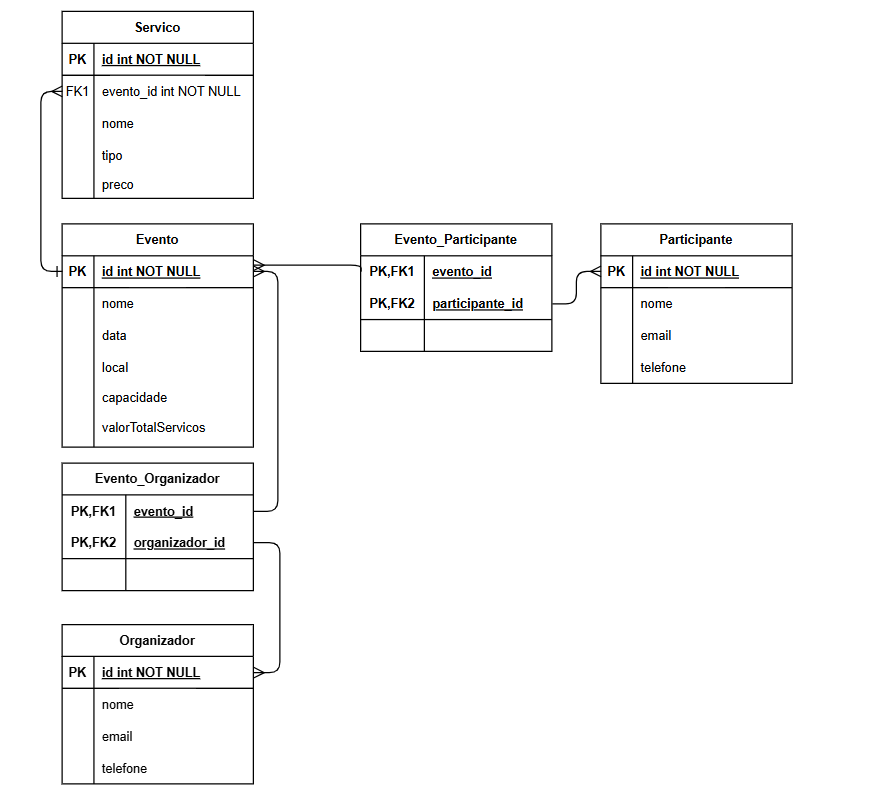

# Gerenciador de Eventos
de: Pedro Gabryel Araújo do Nascimento

## Descrição do Projeto

Esse projeto consiste em um CRUD com funcionalidades voltadas a um gerenciador de eventos, como pequenas convenções, reuniões ou festas. É uma aplicação simples desenvolvida em Java utilizando o framework Spring Boot. O projeto possibilita a gestão de eventos, permitindo que organizadores, participantes e serviços sejam gerenciados, assim como seus dados específicos. A aplicação oferece uma interface de linha de comando que permite a interação do usuário com as funcionalidades disponíveis.

## Funcionalidades

- Cadastro e gerenciamento de eventos.
- Cadastro e gerenciamento de organizadores.
- Cadastro e gerenciamento de participantes.
- Cadastro e gerenciamento de serviços.
- Contratação e cancelamento de serviços para eventos.
- Pesquisa de eventos, organizadores, participantes e serviços.

## Tecnologias Utilizadas

- Java
- Spring Boot
- API REST
- JPA (Java Persistence API)
- Banco de dados (H2 ou outro de sua preferecnia)

## Estrutura do Projeto

### Pacotes Principais

- **entities**: Classes que representam as entidades do sistema, como `Evento`, `Organizador`, `Participante` e `Servico`.
- **controllers**: Contém as classes de controle que gerenciam as requisições HTTP e a lógica de negócios.
- **repositories**: Interfaces que definem os métodos de acesso aos dados, utilizando Spring Data JPA.
- **utilities**: Classes utilitárias que oferecem os menus para o usuário e funcionalidades adicionais para o gerenciamento de eventos.

### Classes Principais

- **GerenciadorEventosApplication**: Classe principal que inicia a aplicação, apresenta a Página Inicial de interação do usuário. Implementa a interface `CommandLineRunner` para executar a lógica inicial ao iniciar o programa.

- **Classes Controller**: Controladores que gerenciam as operações CRUD (Create, Read, Update, Delete) para cada entidade. Uilizam o Spring Framework para facilitar a criação de API's REST.

- **Classes Menu**: Classes que oferecem uma interface de texto para o usuário de linha de comando para interagir com as funcionalidades da aplicação.
